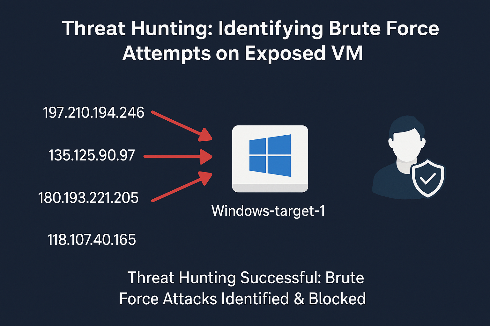
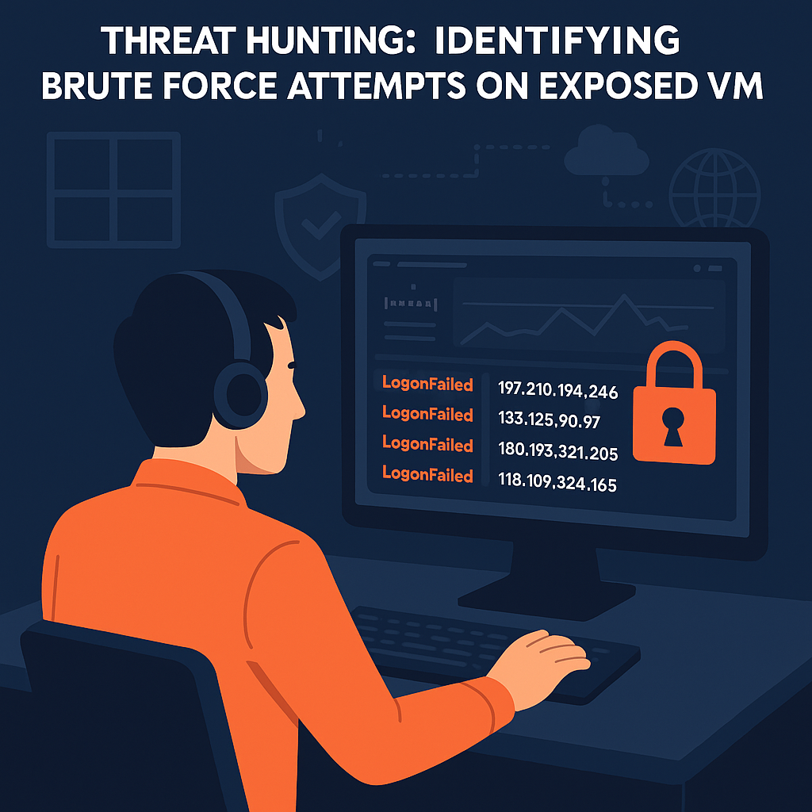

# Threat Hunting: Identifying Brute Force Attempts on Exposed VM 
<p align="center">
</p>

_**Project Overview**_:

In this threat hunting lab, I investigated a **Windows Virtual Machine (VM)** (`windows-target-1`) unintentionally exposed to the internet, using **Microsoft Defender for Endpoint**. I hypothesized that **brute-force login attempts** might have occurred and analyzed logs with **KQL**. The investigation revealed multiple failed login attempts from external IP addresses, but no successful unauthorized access. To remediate, I recommended stronger access controls, including restricting RDP access, updating Network Security Group (NSG) rules, and enabling account lockout policies.

> **Hypothesis:** During the exposure period, brute-force attacks likely occurred due to lack of account lockout policies.

---

<p>
  
  
  
  
</p>

---

# Technologies Utilized
- **Endpoint Detection and Response (EDR): Microsoft Defender for Endpoint (MDE)**
- **Kusto Query Language (KQL)**
- **Virtual Machine (VM): Windows OS**
- **Microsoft Azure**

---

## Table of Contents
- [Preparation Phase](#preparation-phase)
- [Data Collection Phase](#data-collection-phase)
- [Data Analysis Phase](#data-analysis-phase)
- [Investigation Phase](#investigation-phase)
- [Response Phase](#response-phase)
- [Documentation Phase](#documentation-phase)
- [Improvement Phase](#improvement-phase)
- [Summary](#summary)

---

## Preparation Phase

- **Hypothesis:** During device exposure, brute-force attempts may have occurred due to absent lockout policies.
- **Objective:** Investigate unauthorized or suspicious logon activity on the exposed VM.
- **Target Device:** `windows-target-1`

---

## Data Collection Phase

Collected relevant logs from:
- `DeviceInfo`
- `DeviceLogonEvents`

Focused on external login activities.

---

## Data Analysis Phase

**Internet Exposure Check Query:**

```
DeviceInfo
| where DeviceName == "windows-target-1"
| where IsInternetFacing == "true"
| order by Timestamp desc
```

**Finding:** VM `windows-target-1` was publicly exposed until timestamp `2025-04-25T17:28:30Z`.

**Failed Logon Attempts Query:**

```
DeviceLogonEvents
| where DeviceName == "windows-target-1"
| where LogonType has_any("Network", "Interactive", "RemoteInteractive", "Unlock")
| where ActionType == "LogonFailed"
| where isnotempty(RemoteIP)
| summarize Attempts = count() by ActionType, RemoteIP, DeviceName
| order by Attempts desc
```

<p align="center">
  
</p>

**Finding:** Multiple brute-force attempts detected; IP `197.210.194.246` had 65 attempts.

**Cross-check for Successful Logons Query:**

```
let RemoteIPsInQuestion = dynamic(["197.210.194.240","135.125.90.97","180.193.221.205","118.107.40.165","178.20.129.235"]);
DeviceLogonEvents
| where DeviceName == "windows-target-1"
| where LogonType has_any("Network", "Interactive", "RemoteInteractive", "Unlock")
| where ActionType == "LogonSuccess"
| where RemoteIP has_any(RemoteIPsInQuestion)
```

<p align="center">
  
</p>

**Finding:** No successful logins from identified brute-force IPs.

**Legitimate Logons Verification Queries:**

```
DeviceLogonEvents
| where DeviceName == "windows-target-1"
| where ActionType == "LogonSuccess"
```

<p align="center">
  
</p>

```
DeviceLogonEvents
| where DeviceName == "windows-target-1"
| where ActionType == "LogonSuccess"
| where AccountName in ("umfd-1", "dwm-1", "umfd-0", "dwm-0")
```

<p align="center">
  
</p>

**Finding:** Only authorized internal accounts (`umfd-1`, `dwm-1`, `umfd-0`, `dwm-0`) successfully logged in.

---

## Investigation Phase

Linked Findings to **MITRE ATT&CK Tactics:**

- **T1190 – Exploit Public-Facing Application**  


- **T1110 – Brute Force**  


- **T1078 – Valid Accounts** (no compromise observed)  


---

## Response Phase

Simulated security improvements:

- **Network Security Group (NSG) Hardening:**
  - RDP access restricted to trusted IP addresses only.
- **Account Lockout Policy:**
  - Lockout after 4 invalid attempts.
  - Lockout duration set to 10 minutes.
  - Administrator lockout policy enabled.  

- **Multi-Factor Authentication (MFA):**
  - Enabled via Azure Entra ID.

---

## Documentation Phase

- Recorded findings, queries, and visual evidence.
- Archived analysis details and MITRE mappings.

---

## Improvement Phase

- **Lessons Learned:** Improved structured approach in future threat hunts.
- **Detection Tuning:** Configured Sentinel analytic rules for login anomalies.
- **Automation:** NSG and lockout policy compliance checks automated using Azure Policy and PowerShell.
- **Future Hunt Scenarios:** Planned for scenarios involving credential stuffing and lateral movement.

---

## Summary

Investigated an exposed Windows VM (`windows-target-1`) using MDE and KQL. Multiple brute-force attempts confirmed; no unauthorized access achieved. Recommended and simulated security enhancements including NSG rule updates, account lockout policies, and MFA.

---

**Visual Evidence** *(Images placed in `source/` directory)*:

```


```

---

**Project Directory Structure:**

```
Threat-Hunting-BruteForce-Analysis/
├── README.md
└── source/
    ├── mde_exposed_vm.png
    ├── failed_logins_summary.png
    ├── burst_activity.png
    └── successful_logons.png
```

---

**License:** MIT License © Venkata Bharath Devulapalli
